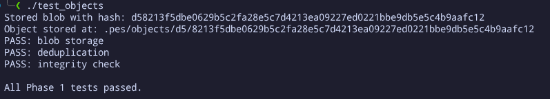
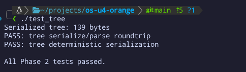
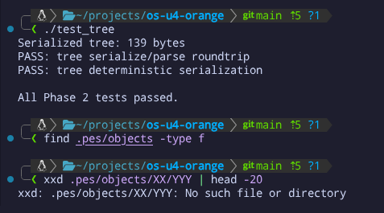
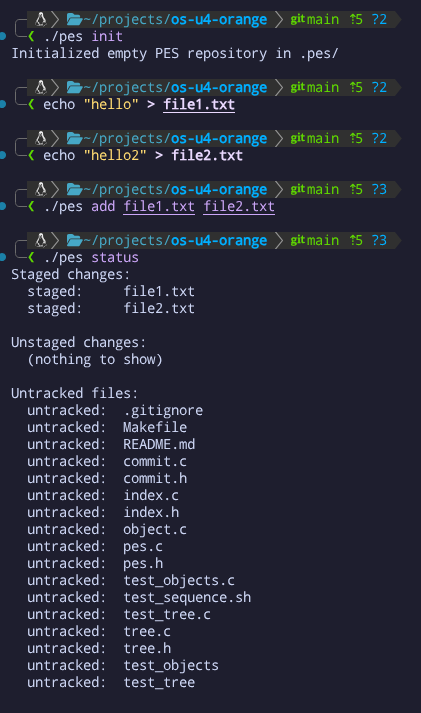
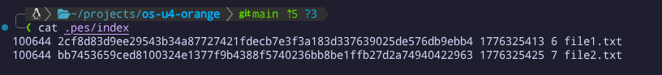
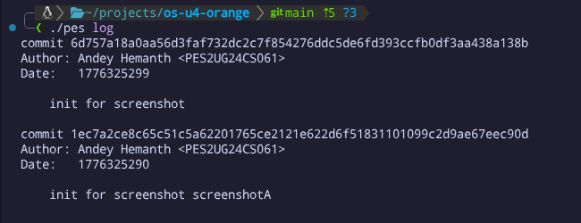
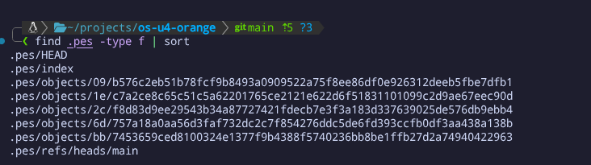
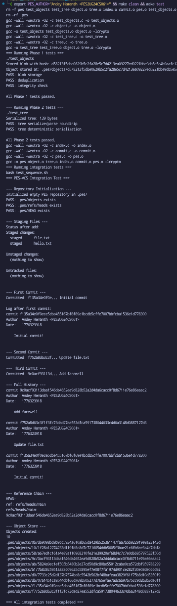

# PES-VCS Project Report

## Overview

This repository contains a working implementation of PES-VCS, a small local version control system built in C. It stores file contents as hashed objects, builds trees from staged files, records commit history, and updates branch references through a HEAD pointer.

## What Changed

The implementation is split across four core source files:

- `object.c`: stores and reads content-addressed objects with integrity checks
- `tree.c`: builds tree objects from the staged index
- `index.c`: loads, saves, and updates the staging area
- `commit.c`: creates commits and updates repository history

The result follows a simplified Git workflow:

1. `pes add` stores file data in the object database and updates the index.
2. `pes commit` builds a tree from the index and writes a commit object.
3. `pes log` walks the commit chain through the branch reference.

## Build And Test

```bash
make
make test_objects
make test_tree
make test-integration
```

The implementation was verified with the object tests, tree tests, and the full integration sequence.

## Screenshots

### Phase 1




### Phase 2





### Phase 3





### Phase 4






### Final



## Notes

The screenshots show the staged repository workflow, object storage layout, tree serialization output, commit history, reference chain, and the final integration test run.
